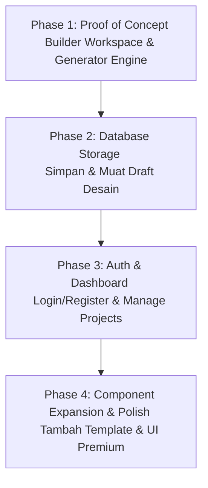

# Blueprint: Web-to-Web Builder

Proyek ini bertujuan untuk membangun platform **Web-to-Web Builder**—sebuah website builder nyata dan terstruktur yang memungkinkan pengguna untuk merancang dan menghasilkan (generate) proyek website mereka secara visual langsung dari browser tanpa perlu menulis kode di VS Code.

---

## 1. Visi & Tujuan Proyek

- **No-Code Web Development:** Pengguna dapat mendesain landing page atau website multi-halaman secara visual.
- **HTML Preview System:** Menyediakan render preview HTML instan di dalam browser agar pengguna bisa melihat hasil sebelum mengunduh.
- **Live Preview Page (New Tab):** Menyediakan halaman pratinjau publik (misal: `/preview/{project_slug}`) yang membuka website hasil rancangan user di tab baru secara live.
- **Multi-Stack Project Generator (Downloadable):** Ini adalah fitur premium utama. Pengguna dapat memilih teknologi target saat mengunduh proyek mereka:
  1. **Laravel + Blade + Tailwind:** Struktur MVC Laravel lengkap siap pakai di Laragon.
  2. **React (Vite) + Tailwind:** Proyek SPA React modern dengan build tool Vite.
  3. **Vue (Vite) + Tailwind:** Proyek SPA Vue 3 modern dengan build tool Vite.
  4. **HTML + CSS + JS Statis:** Folder statis bersih untuk hosting tradisional.

---

## 2. Arsitektur & Teknologi Utama

### Backend (Laravel 11+ - Parent Builder)
- **Laravel Eloquent & DB:** Mengelola data pengguna, proyek, halaman, dan konfigurasi komponen.
- **Inertia.js + Vue.js (Vite):** Kerangka kerja utama frontend untuk interaksi Workspace Builder yang sangat cepat dan mulus tanpa refresh halaman (SPA).
- **Generator Engine (Strategy Pattern):** 
  - Menggunakan design pattern *Strategy* di PHP. Kita memiliki satu interface `ProjectGeneratorInterface` dengan beberapa class implementation:
    - `LaravelGenerator`
    - `ReactViteGenerator`
    - `VueViteGenerator`
    - `StaticHtmlGenerator`
  - Backend akan mendeteksi pilihan teknologi user, menyalin boilerplate folder yang sesuai di `storage/app/boilerplates/{stack_name}`, menyisipkan kode HTML/CSS/JS dinamis hasil desain user, dan membungkusnya menjadi berkas `.zip`.

### Frontend (Builder Interface)
- **Vite + Tailwind CSS:** Antarmuka Workspace Builder yang premium dan modern.
- **Visual Component Builder:**
  - **Component Library Sidebar:** Menyediakan block komponen Tailwind premium (Navbar, Hero, Sidebar Menu, Features, Pricing, Contact Form, Footer).
  - **Interactive Canvas:** Area drag-and-drop tempat menyusun komponen.
  - **Inline & Sidebar Editor:** Pengguna bisa mengedit teks langsung (inline editing), mengubah warna tema, mengganti URL gambar, dan menambahkan link navigasi.
- **Live Preview Frame:** Menggunakan `<iframe>` untuk menampilkan preview HTML real-time berdasarkan state JSON dari editor.

---

## 3. Peta Route & Alur Pengguna (User Journey)

### **A. Landing Page (Route `/`)**
Halaman depan utama dengan struktur:
1. **Hero Section:**
   - Headline: *"Rancang dan Publikasikan Website Impian Anda Tanpa Satu Baris Kode Pun"*
   - Subheadline: *"Gunakan visual builder drag-and-drop, pilih template siap pakai, dan unduh ke teknologi favorit Anda (Laravel, React, Vue, atau HTML)"*
   - **Dual CTA:**
     - Tombol Primer: *"Mulai Buat Website Gratis"* ➡️ Mengarahkan ke halaman Register/Onboarding (`/register`).
     - Tombol Sekunder: *"Lihat Demo Editor"* ➡️ Mengarahkan ke Demo Builder tanpa login (`/demo`).
2. **Anatomi Fitur (Solusi):** Visual Builder, Live Preview Page, dan Multi-Stack Download.
3. **Galeri Template:** Tampilan kategori template (Bisnis, Portofolio, Toko Online, Form) dengan tombol preview.
4. **Pricing Tier (Sederhana):**
   - **Free/Trial:** Membuat & preview online.
   - **Premium:** Download full source code project (pilihan Laravel, React, Vue, HTML).

### **B. Onboarding Wizard (Pasca-Registrasi)**
Untuk menghindari kebingungan pengguna (blank slate), setelah registrasi user diarahkan ke wizard:
1. **Pilih Tujuan (`/onboarding/step-1`):** Memilih kategori web (Portofolio, Toko Online, Landing Page Bisnis, atau Event).
   * **Opsi Tambahan (Bypass):** Terdapat tombol/link jelas: *"Mulai dari Kanvas Kosong (Desain dari Awal)"* jika pengguna tidak ingin menggunakan template dan ingin merakit komponen sendiri dari nol.
2. **Pilih Fondasi (`/onboarding/step-2`):** Menampilkan daftar template yang cocok dengan pilihan mereka di Langkah 1.
3. **Masuk Editor (`/builder/{project_slug}`):** 
   * Jika memilih template: Membuka kanvas yang sudah terisi konten template terpilih.
   * Jika memilih *"Kanvas Kosong"*: Membuka kanvas kosong bersih dengan tombol panduan awal untuk menambahkan komponen pertama.

### **C. Workspace Builder (`/builder/{project_slug}` atau `/demo`)**
Antarmuka visual editor berbasis Vue + Inertia untuk merancang layout halaman.

### **D. Live Preview Page (`/preview/{project_slug}`)**
Membuka halaman web hasil desain user di tab baru secara utuh (tanpa sidebar editor) untuk melakukan pengujian fungsionalitas visual secara langsung di browser.

### **E. Dashboard Proyek (`/dashboard`)**
Halaman utama setelah user login. Menampilkan:
- Daftar proyek yang sudah dibuat.
- Tombol **Edit** ➡️ Membuka kembali editor `/builder/{project_slug}`.
- Tombol **Buka Preview** ➡️ Membuka link `/preview/{project_slug}` di tab baru.
- Tombol **Download Source Code** ➡️ Memunculkan popup untuk memilih format stack (Laravel, React, Vue, atau HTML Statis) lalu mengunduh ZIP-nya.

---

## 4. Rencana Pengembangan Bertahap (Phases)

Untuk menghindari membuang waktu pada fitur standar (seperti login) sebelum membuktikan bahwa fitur utama kita berfungsi, kita akan menggunakan pendekatan **Core-First (Fitur Utama Dulu)**:

### **Tahap 1: Proof of Concept (Workspace & Generator Core) 🚀 (SEKARANG)**
- **Tujuan:** Membuktikan bahwa kita bisa menyusun komponen visual di browser dan mendownloadnya sebagai project pilihan (Laravel/React/Vue/HTML) yang berjalan lokal.
- **Langkah Kerja:**
  1. Membuat halaman workspace builder sederhana (tanpa login) di route `/demo`.
  2. Menyediakan 2-3 blok komponen Tailwind (Navbar, Hero, Footer) di panel samping.
  3. Membuat class `LaravelGenerator` (sebagai implementasi awal dari generator engine) untuk membungkus komponen terpilih menjadi struktur project Laravel minimal (Vite + Tailwind).
  4. Menyediakan tombol "Download Project" untuk mengunduh `.zip` secara langsung.

---

## 5. Keputusan & Desain Sistem (Telah Disepakati)

### 1. Template Proyek Hasil Generate: **Multi-Stack Output**
Untuk memberikan kepuasan maksimal dan fungsionalitas profesional:
- Mendukung output **Laravel 11+**, **React (Vite)**, **Vue 3 (Vite)**, dan **HTML Statis**.
- Dilengkapi integrasi **Tailwind CSS**.
- Untuk form yang ditambahkan, generator akan menyediakan backend logic yang sesuai dengan stack pilihan (misal: Controller di Laravel, API handler placeholder di React/Vue).

### 2. Konsep UI Workspace Builder: **Tailwind Component-Based Drag & Drop dengan Deep Editing**
- **Katalog Komponen:** Menyediakan panel komponen lengkap (Navbar, Hero Section, Content, Sidebar Navigation, Footer, Buttons).
- **Kustomisasi Penuh:** Setelah komponen ditarik ke dalam kanvas, pengguna bisa:
  - Mengubah teks secara langsung (Double-click inline edit).
  - Mengubah warna, latar belakang, ukuran font, border, dll., melalui sidebar inspector.
  - Menyusun ulang urutan komponen (Drag-and-drop reorder).
  - Menambahkan item baru (misalnya menambah item menu pada navbar/sidebar).

---
*(Dokumen ini akan terus diperbarui seiring berjalannya diskusi kita.)*
